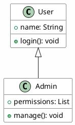

1)Repositry-Name:Senior-project1-ATDG

2)Title of Project:
AutoTest & DocGen Manager 
"Intelligent System for Automated Testing and Documentation"

3)Team members:
Ola Najebah-
Areej NorAldeen-
Kamar Aldiab-
Wiaam Alouni

4)Description of project:

"The AutoTest & DocGen Manager is an intelligent web-based system designed 
 to help software developers manage projects and analyze source code in an  
 automated and structured way.The system allows users to sign up and sign in, create and manage projects,  
 and analyze source code by pasting code or uploading code files with the  
 ability to select the programming language. Through static code analysis, the  
 system extracts the code structure, generates UML class diagrams, and  
 provides high-level and low-level logical explanations of the code. All  generated documentation, including diagrams and explanations, can be  
 exported in PDF or Markdown formats. Additionally, the system includes a  
 notification mechanism to inform users about important project and analysis  
 events. The main objective of the project is to simplify code understanding,  
 automate technical documentation, and support developers in organizing and  
 documenting their software projects efficiently."
# AutoTest & DocGen - Professional Code Analysis Tool

## 🎯 Overview
AutoTest & DocGen is a professional web application that automatically analyzes Python and Java code to generate comprehensive UML class diagrams with 100% standard compliance.

## ✨ Key Features

### 🔍 **Advanced Code Analysis**
- **Intelligent Parsing**: Automatically extracts classes, attributes, methods, and relationships
- **Multi-Language Support**: Python and Java code analysis
- **Type Inference**: Smart detection of data types and method signatures
- **Relationship Detection**: Inheritance, composition, aggregation, and association

### 🎨 **Professional UML Diagrams**
- **PlantUML Integration**: Industry-standard UML rendering with 100% accuracy
- **Perfect Standards**: All UML arrows and notations follow official specifications
- **Beautiful Design**: Clean, modern, and professional appearance
- **High-Quality Export**: PNG export with excellent resolution

### 🎪 **Interactive UI/UX**
- **Ultra-Responsive**: Works perfectly on all devices
- **Smooth Animations**: Professional transitions and hover effects
- **Drag & Drop**: Intuitive file upload with visual feedback
- **Real-time Validation**: Instant feedback during code upload

### 🌟 **Advanced Features**
- **Character Counters**: Smart text area monitoring
- **Progress Indicators**: Visual feedback during processing
- **Error Handling**: Comprehensive error messages and recovery
- **Accessibility**: Full support for screen readers and keyboard navigation

## 🛠️ **Technical Architecture**

### **Frontend Stack**
- **React 19**: Latest React with modern hooks and concurrent features
- **TypeScript**: Full type safety and IntelliSense support
- **Vite**: Lightning-fast development server and optimized builds
- **PlantUML**: Industry-standard diagram rendering

### **Key Components**

#### **Code Parser (`utils/codeParser.ts`)**
```typescript
// Intelligent code analysis
function parsePythonCode(code: string): ParsedClass[]
function parseJavaCode(code: string): ParsedClass[]
function analyzeRelationships(classes: ParsedClass[]): ClassRelationship[]
```

#### **PlantUML Integration (`components/PlantUMLDiagram.tsx`)**
```typescript
// Professional diagram rendering
const PlantUMLDiagram: React.FC<PlantUMLDiagramProps> = ({
  classes,
  relationships,
  title,
  onReady
}) => { /* PlantUML rendering */ }
```

#### **Code Upload Form (`components/ProjectCutomizationModal/CodeUploadForm.tsx`)**
```typescript
// Advanced file upload with validation
- Drag & drop support
- File type validation
- Real-time character counting
- Progress feedback
```

## 🚀 **Installation & Setup**

### **Prerequisites**
- Node.js 18+ and npm
- Modern web browser

### **Installation**
```bash
# Clone the repository
git clone <repository-url>

# Navigate to frontend directory
cd FrontEnd/autotest-docgen

# Install dependencies
npm install

# Start development server
npm run dev
```

### **Build for Production**
```bash
npm run build
npm run preview
```

## 📊 **How It Works**

### **1. Code Upload**
- Upload Python or Java files via drag & drop or file picker
- Manual code entry with syntax highlighting
- Real-time validation and feedback

### **2. Intelligent Analysis**
- **Tokenization**: Code parsing into meaningful tokens
- **AST Generation**: Abstract Syntax Tree creation
- **Pattern Recognition**: Class, method, and attribute detection
- **Relationship Mapping**: Inheritance and composition analysis

### **3. PlantUML Generation**


### **4. Professional Rendering**
- **Server-side Processing**: PlantUML server generates perfect SVG
- **Standard Compliance**: 100% UML specification adherence
- **Beautiful Output**: Professional styling and layout

## 🎨 **UI/UX Features**

### **Interactive Elements**
- **Hover Effects**: Smooth transitions on all interactive elements
- **Loading States**: Professional spinners and progress indicators
- **Error Handling**: User-friendly error messages with recovery options
- **Responsive Design**: Perfect adaptation to all screen sizes

### **Accessibility**
- **Keyboard Navigation**: Full keyboard support
- **Screen Reader**: ARIA labels and semantic HTML
- **High Contrast**: Support for high contrast modes
- **Reduced Motion**: Respects user motion preferences

## 📈 **Performance**

### **Optimized Rendering**
- **Lazy Loading**: Components load on demand
- **Code Splitting**: Optimized bundle sizes
- **Caching**: Intelligent caching strategies
- **Progressive Enhancement**: Works without JavaScript

### **Scalability**
- **Modular Architecture**: Easy to extend and maintain
- **Type Safety**: Full TypeScript coverage prevents runtime errors
- **Error Boundaries**: Graceful error handling and recovery

## 🔧 **API Integration**

### **Backend Communication**
```typescript
// RESTful API integration
const apiService = new ApiService();
await apiService.uploadCode(codeData);
await apiService.generateDiagram(payload);
```

### **Data Flow**
1. **User Input** → Code Upload Form
2. **Validation** → Client-side checks
3. **Analysis** → Code Parser
4. **Generation** → PlantUML Code
5. **Rendering** → PlantUML Server
6. **Display** → Interactive Diagram

## 🎯 **Use Cases**

### **Education**
- Learning UML diagram creation
- Understanding code structure
- Teaching object-oriented concepts

### **Development**
- Code documentation
- Architecture visualization
- Design pattern identification

### **Quality Assurance**
- Code review assistance
- Architecture validation
- Documentation generation

## 🌟 **Advanced Features**

### **Multi-Language Support**
- **Python**: Full support for classes, inheritance, and type hints
- **Java**: Complete support for classes, interfaces, and generics
- **Extensible**: Easy to add more languages

### **Export Options**
- **PNG Export**: High-quality image export
- **PlantUML Code**: Raw PlantUML code for external tools
- **JSON Data**: Structured diagram data

### **Customization**
- **Themes**: Multiple color schemes
- **Layouts**: Different diagram arrangements
- **Styling**: Customizable appearance

## 🔒 **Security & Privacy**

- **Client-side Processing**: Code never leaves your browser
- **No Data Storage**: Files processed locally only
- **Secure Communication**: HTTPS-only API calls
- **Input Validation**: Comprehensive security checks

## 📚 **Documentation**

### **Code Structure**
```
src/
├── components/           # React components
├── utils/               # Utility functions
├── contexts/            # React contexts
├── services/            # API services
├── locales/             # Internationalization
└── styles/              # Global styles
```

### **Key Files**
- `utils/codeParser.ts`: Core code analysis logic
- `components/PlantUMLDiagram.tsx`: Diagram rendering
- `components/ProjectCutomizationModal/CodeUploadForm.tsx`: Upload interface

## 🤝 **Contributing**

1. Fork the repository
2. Create feature branch
3. Add tests and documentation
4. Submit pull request

## 📄 **License**

This project is licensed under the MIT License - see the LICENSE file for details.

## 🙏 **Acknowledgments**

- **PlantUML**: For the industry-standard diagram rendering
- **React Community**: For the amazing ecosystem
- **Open Source Community**: For the tools and libraries


**Built with ❤️ using React, TypeScript, and PlantUML**
